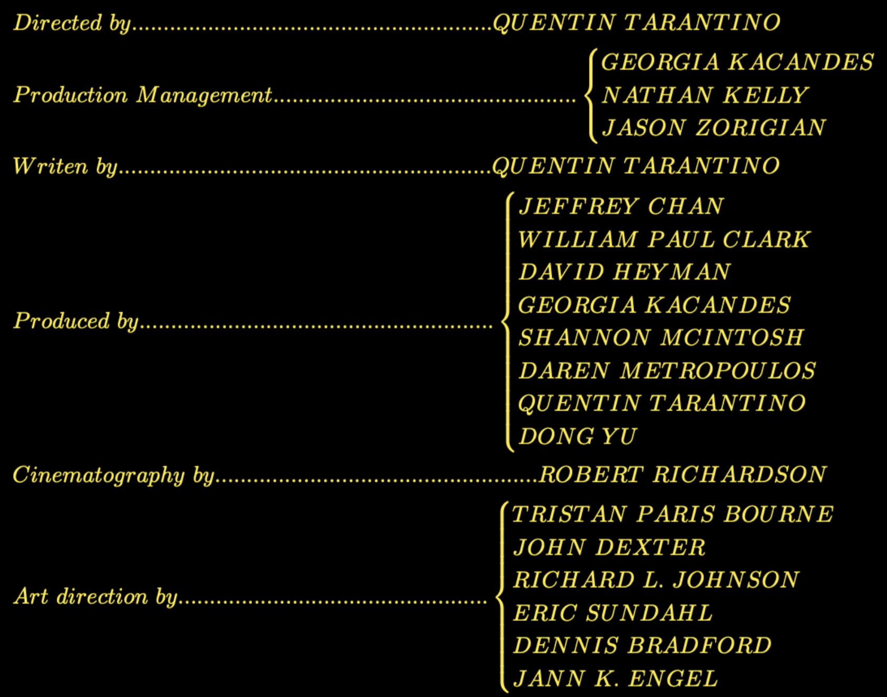

# Description

---
After re-watching this beautiful Quentin Tarantino movie, it was hard not 
getting impressed with the end-credits calligraphy.

This here script transforms any lineup, given in *Python* dictionary or *json*
format, to a *Latex* equation or document, in the style of the movie's 
end-credits.


# Requirements
Developed under Python 3.10


# Execution

Running the [script](main.py), the crew's input is expected to be 
[here](files/crew.json)(example supplied).
*Latex* output will be saved in *files/ouatih.tex*. 

Alternatively the function *main.produce_latex* can be imported and executed.


# Example
Running with the following example data,
```
{
  "Directed by": "Quentin Tarantino",
  "Production Management": [
    "Georgia Kacandes",
    "Nathan Kelly",
    "Jason Zorigian"
  ],
  "Writen by": "Quentin Tarantino",
  "Produced by": [
    "Jeffrey Chan",
    "William Paul Clark",
    "David Heyman",
    "Georgia Kacandes",
    "Shannon McIntosh",
    "Daren Metropoulos",
    "Quentin Tarantino",
    "Dong Yu"
  ],
  "Cinematography by": "Robert Richardson",
  "Art direction by": [
    "Tristan Paris Bourne",
    "John Dexter",
    "Richard L. Johnson",
    "Eric Sundahl",
    "Dennis Bradford",
    "Jann K. Engel"
  ]
}
```
we get an output string that when compiled as *latex* looks like this:


